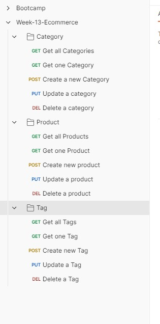

# E-Commerce Back End

## User Story

```md
AS A manager at an internet retail company
I WANT a back end for my e-commerce website that uses the latest technologies
SO THAT my company can compete with other e-commerce companies
```

## Acceptance Criteria

```md
GIVEN a functional Express.js API
WHEN I add my database name, MySQL username, and MySQL password to an environment variable file
THEN I am able to connect to a database using Sequelize
WHEN I enter schema and seed commands
THEN a development database is created and is seeded with test data
WHEN I enter the command to invoke the application
THEN my server is started and the Sequelize models are synced to the MySQL database
WHEN I open API GET routes in Insomnia for categories, products, or tags
THEN the data for each of these routes is displayed in a formatted JSON
WHEN I test API POST, PUT, and DELETE routes in Insomnia
THEN I am able to successfully create, update, and delete data in my database
```

## Description

This project consists in a E-commerce Back End API that will give us some details when we request from it. We are able to get some information from different Categorys, Products and Tags. Also using this API we are able to see All - Products, Categorys , and Tags , see only one of them or update and delete them. This project containd 1 SQL file , 17 Javascript files anbd one .env file.

The biggest challenge for me during this project was how to work with postman and making sure i was testing everything with it. At some points i found myself a bit lost while working with it and not knowing exactly how to use it properly. Another challenge i found was working with the routes since i do struggle a bit with it but at the end i was able to get them to work and able to make them work correctly.

This challenge helped me a lot because it made my understanding of API higher and also made more confident while working with postman in terms of fetiching the information and organise it so its understandable. There was a few more point in where this challenge helped me that i will be listing bellow.

- Higher understanding of Postman
- Higher speeds working with Javacript
- Better understanding of API

## Table of Contents

- [Installation](#installation)
- [Usage](#usage)
- [Tests](#tests)
- [License](#license)
- [Questions](#questions)

## Installation

To install the necessary dependencies, run the following command:

```
npm i
```

## Usage

To use this repository is pretty simple. You will have to clone the repo , and soon as you clone it and open it, you will need to open your terminal and run the following command (npm i). Soon as you runned this command you will need to login in your mysql by doing (mysql -u root -p) and then you will be asked to type your password. After typing your password and getting inside mysql you will need to run (source/db/schema.sql) and then type (quit;) to leave the mysql. After leaving the mysql you will need to run this following commands in your mysql (npm run seed) and after run (npm run start). After running this 2 commands you will see your localhost was made and you should be able to get the information on postman after that.



## Tests

I will be listing the tests i have done.

```
Tested - Get all Categories
Tested - Get one Category
Tested - Create a new Category
Tested - Update a Category
Tested - Delete a Category
Tested - Get all Products
Tested - Get one Product
Tested - Create a new Product
Tested - Update a Product
Tested - Delete a Product
Tested - Get all Tags
Tested - Get one Tag
Tested - Create a new Tag
Tested - Update a Tag
Tested - Delete a Tag
```

## License


This project is licensed under the MIT license.

## Questions

For any questions or inquiries, feel free to reach out to me:

- GitHub: [DiogoS77](https://github.com/DiogoS77)
- Email: diogo.messi.18@hotmail.com
- [Watch the Video](https://drive.google.com/file/d/1oYXIqnO7K49Qt2Iiwugl0QF3uH1GON0s/view)
